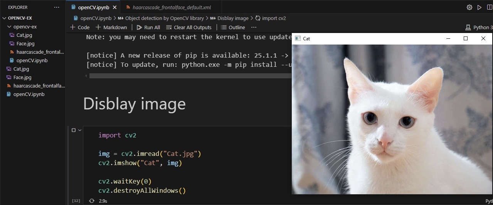
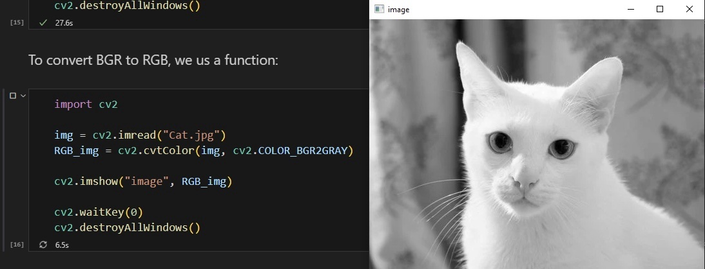
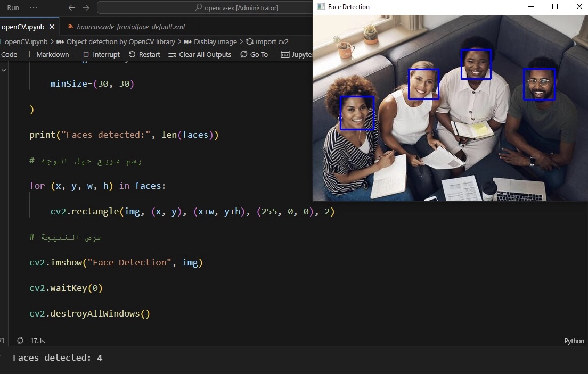

# OpenCV Face Detection

This project demonstrates some basic OpenCV operations using Python. It includes displaying an image, converting it to grayscale, and detecting human faces using the Haar Cascade classifier.

## Features

* Display an image using OpenCV

* Convert an image to grayscale

* Detect human faces using Haar Cascade

* Draw rectangles around detected faces

## Technologies Used

* Python

* OpenCV

## Project Files

* `openCV.ipynb` – Main notebook containing the code.

* `Cat.jpg` – Image used for display and grayscale conversion.

* `Face.jpg` – Image used for face detection.

* `haarcascade_frontalface_default.xml` – Haar Cascade classifier for face detection.

## Results

### Display Image

### Grayscale Conversion

### Face Detection

## How to Run

1. **Install OpenCV:**

`pip install opencv-python`

2. Make sure all project files are in the same folder.

3. Open and run the `openCV.ipynb` notebook.
 
